# README.md

## Posikarto: Road Sign Detection and Localization in Point Clouds


### Overview

This project focuses on detecting and localizing road signs within point clouds classified using the Semantikarto point cloud semantic segmentation model. The process involves extracting road sign point clouds, calculating geometric features, clustering, and finally estimating the positions of the detected road signs.

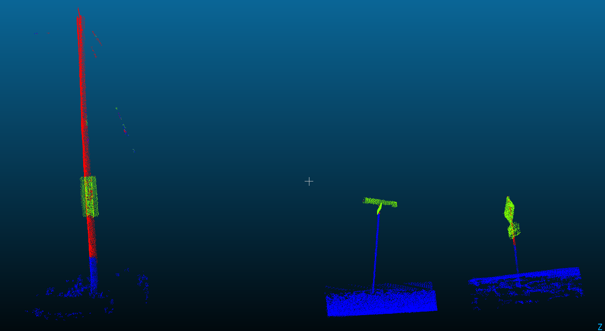

### Steps

### 1. Loading and Filtering Point Cloud Data

- The project begins by loading point cloud data from specified files in a given input folder.
- The Semantikarto model has previously classified road signs in the point clouds using the RandLA-Net architecture.
- Filtering is performed to extract road sign points by retaining points labeled as road signs and removing all other classes.

<!-- <p float="left">
  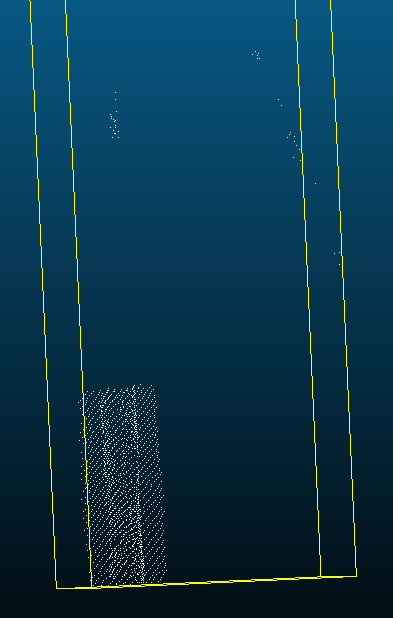
  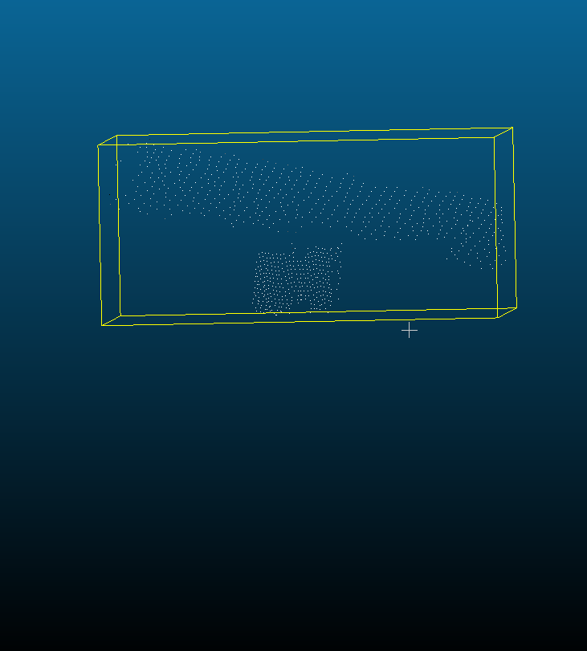 
  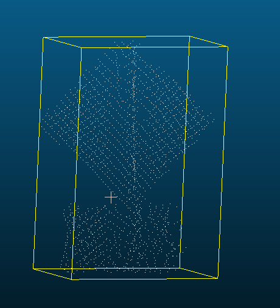
</p> -->

<div align="center">
  <div style="display: inline-block; text-align: center;">
    
    <p>Roadsign 1</p>
  </div>
  <div style="display: inline-block; text-align: center;">
    
    <p>Roadsign 2</p>
  </div>
  <div style="display: inline-block; text-align: center;">
    
    <p>Roadsign 3</p>
  </div>
</div>

<!-- 


 -->

### 2. Calculating Geometric Features with Jakteristics

- Geometric features are calculated on the extracted road sign point clouds using the Jakteristics library.
- Features like planarity, omnivariance, and others are computed to describe the geometric characteristics of the points.
- A planarity threshold is set, and points below this threshold are removed to ensure high planarity.

<!-- <p float="left">
  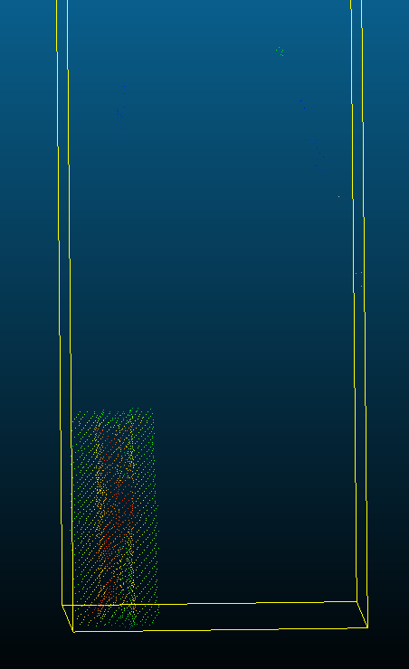
  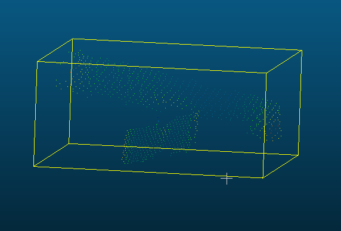 
  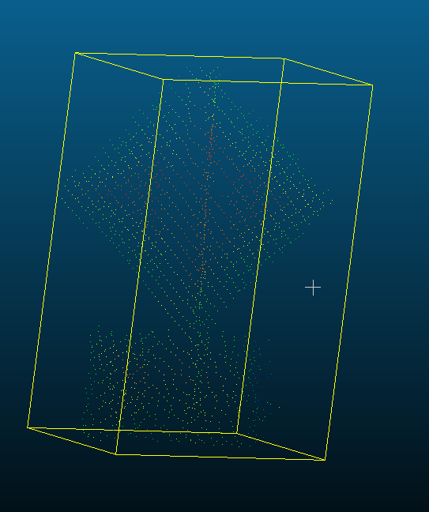
</p> -->

<div align="center">
  <div style="display: flex; justify-content: center; align-items: center;">
    
    
    
  </div>
</div>

<!-- 


 -->

### 3. DBSCAN Clustering

- DBSCAN (Density-Based Spatial Clustering of Applications with Noise) clustering algorithm is applied to the filtered point clouds.
- The feature columns are standardized, and DBSCAN clusters the points into groups based on their spatial density.
- The cluster with the highest average planarity value is selected as it is likely to correspond to a road sign.

<!-- <p float="left">
  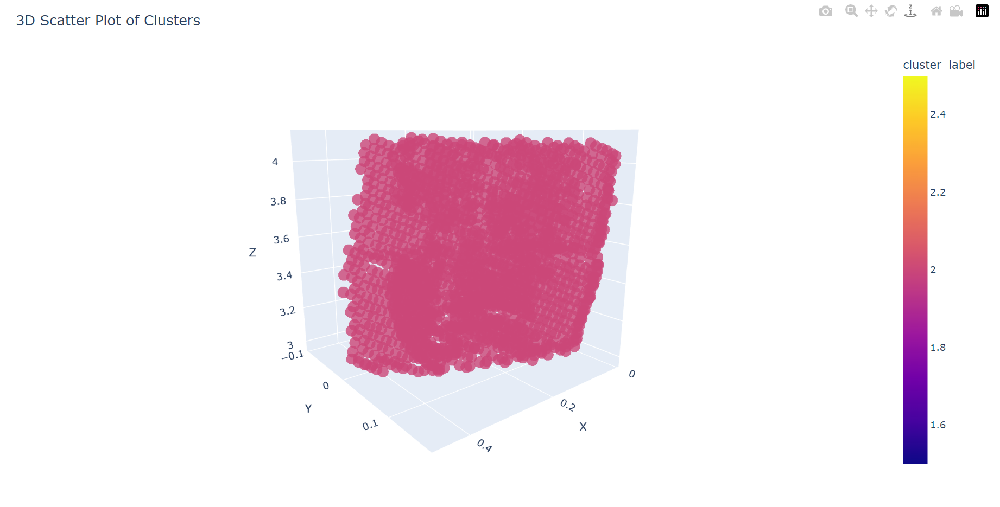
  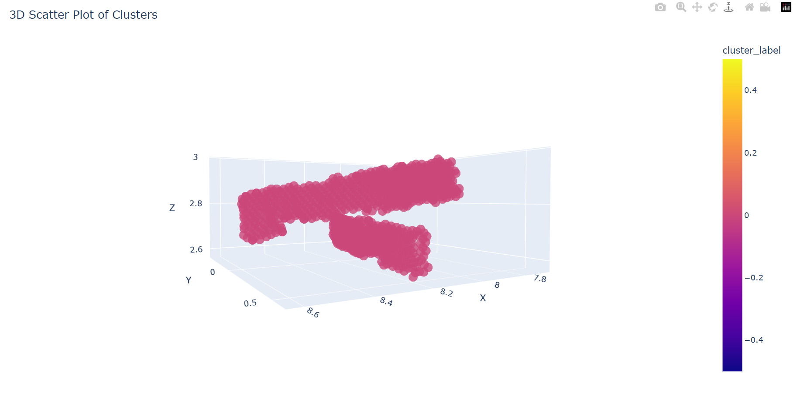 
  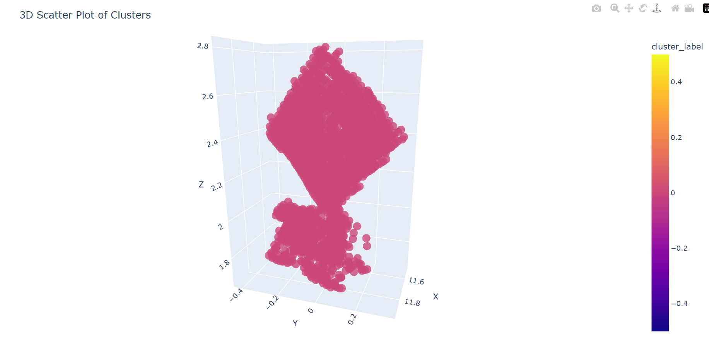
</p> -->

<div align="center">
  <div style="display: inline-block; text-align: center;">
    
    <p>Roadsign 1</p>
  </div>
  <div style="display: inline-block; text-align: center;">
    
    <p>Roadsign 2</p>
  </div>
  <div style="display: inline-block; text-align: center;">
    
    <p>Roadsign 3</p>
  </div>
</div>


<!-- 


 -->

### 4. Estimating Road Sign Positions

- For each cluster, the center point is computed by averaging the X, Y, and Z coordinates of the points.
- The estimated center points represent the positions of the detected road signs.
- These center points are collected and saved in a CSV file for further analysis.

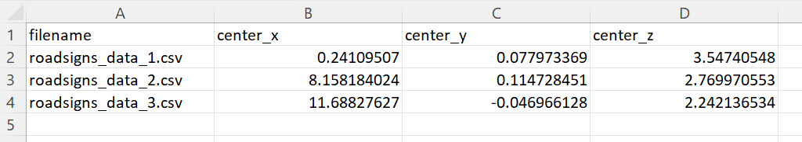 

### Workflow

1. **Loading and Filtering**: Load point cloud data and extract road sign points based on classification results.
2. **Geometric Feature Calculation**: Compute geometric features on the road sign points using Jakteristics.
3. **DBSCAN Clustering**: Apply DBSCAN clustering to identify clusters with high planarity.
4. **Estimating Positions**: Calculate center points of clusters as the estimated road sign positions.

### Libraries Used

- Semantikarto: Point cloud semantic segmentation model using RandLA-Net.
- Jakteristics: Library for calculating geometric features on point clouds.
- Jaklas: Library for reading, processing, and writing point cloud files.
- pandas: Library for data manipulation and analysis.
- scikit-learn: Library for machine learning algorithms, including DBSCAN.

### Output

The output of the project is a collection of estimated road sign positions in the form of center points. These positions are saved in CSV files, providing valuable information for road sign localization in the given point clouds.

This project integrates machine learning techniques for classification and clustering with geometric analysis to enable accurate road sign detection and precise localization within point clouds.

### Evaluation Function

**********************************************Using csv_evaluation.py**********************************************

This evaluation function requires users to select a ground truth and enter its coordinates in a csv file. Common practice is to use CloudCompare for obtaining a ground truth point. The function then takes the distance between the ground truth and estimated position to evaluate the accuracy of the prediction produced by Posikarto.

```python
(posikarto) PS C:\Users\ebrereton\posikarto\posikarto> python .\csv_evaluation.py C:\Users\ebrereton\posikarto\posikarto\roadsign_position\roadsign_1_groundtruth_center_points.csv C:\Users\ebrereton\posikarto\posikarto\roadsign_position\roadsign_1_estimated_center_points.csv
```

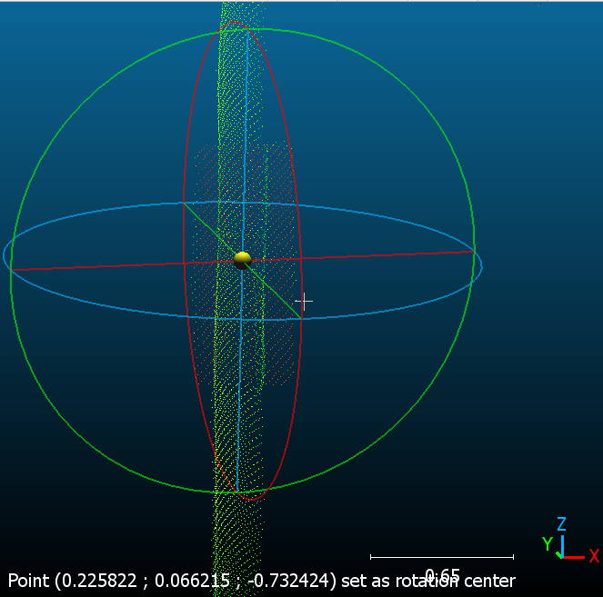

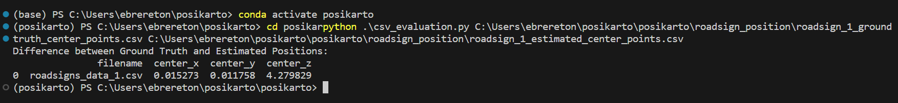


************************Using evaluation_function.py************************

This evaluation function allows users to enter a .laz file (ground truth) and the .csv of the predicted position. The function aims to determine a ground truth by normalizing the point cloud and computing the coordinate averages. The function then takes the distance between the ground truth and estimated position to evaluate the accuracy of the prediction produced by Posikarto.

```python
(posikarto) PS C:\Users\ebrereton\posikarto\posikarto> python .\evaluation_function.py C:\Users\ebrereton\posikarto\posikarto\inputs\roadsigns_data_1.laz C:\Users\ebrereton\posikarto\posikarto\roadsign_position\center_points.csv
```

```python
[0    0.047326 dtype: float64, 
 0   -0.075733 dtype: float64, 
 0   -0.708584 dtype: float64]
```

### Installation

1. Clone the repository:
    
    ```
    git clone <https://github.com/yourusername/road-sign-detection.git>
    cd road-sign-detection
    
    ```
    
2. Set up the environment and install dependencies:
    
    ```
    pip install -r requirements.txt
    
    ```
    
3. Run the main script:
    
    ```
    python main.py
    
    ```
    

### Conclusion

This project seamlessly combines machine learning classification, geometric feature extraction, and clustering to achieve accurate road sign detection and localization from point clouds. By following the workflow and setup instructions, you can apply this pipeline to your own point cloud data and enhance road safety through improved road sign identification.

For detailed code snippets, see the provided [scripts](notion://www.notion.so/scripts/) folder.

### Contributing

Contributions are welcome! Please feel free to open issues and pull requests to enhance this project further.

### License

This project is licensed under the [MIT License](notion://www.notion.so/LICENSE).

---

By [@emilybrereton](https://github.com/emilybrereton)
